<div align="center">


[](README.md) [](README.ru.md) [](docs/INSTALL.md) [](https://www.nexusmods.com/assettocorsa/mods/124) [](https://ko-fi.com/flopsy2iq)

[](https://github.com/flopsy2iqq/ac-dlssg/releases/latest) [](https://github.com/flopsy2iqq/ac-dlssg/releases) [](https://github.com/flopsy2iqq/ac-dlssg/actions/workflows/build.yml)  [](LICENSE)

NVIDIA DLSS Frame Generation (DLSS-G 2X, 3X and 4X) for **Assetto Corsa** with **Custom Shaders Patch**.

</div>

**Version 1.1.0. Frame generation works in game.** On the test PC the frame rate doubles with no ghosting and no blur. The pictures are in [Screenshots](#screenshots).

Assetto Corsa renders with DirectX 11. DLSS Frame Generation runs only on DirectX 12 and Vulkan, through NVIDIA Streamline. ac-dlssg connects the two:

- The game keeps rendering in DirectX 11.
- Each finished frame is presented through a DirectX 12 swap chain created with Streamline, and DLSS-G inserts a generated frame between every two real ones.
- Depth and motion vectors come from the DLSS upscaling pass that CSP already runs.
- The camera comes from a small CSP Lua app that the installer adds.

## Screenshots

DLSS-G 2X in Assetto Corsa with CSP:

- **Top left:** CSP's FPS counter. It shows the **real** frames the game renders.
- **Top right:** the NVIDIA overlay. It shows the frames **on screen after frame generation**.

Test PC: Intel Core i9-9900 (8 cores, 16 threads), GeForce RTX 3080 10 GB (driver 616.64), 16 GB DDR4-3600, Windows 10 22H2, CSP 0.3.0-preview622, dlssg_for_sm86 0.3.5.

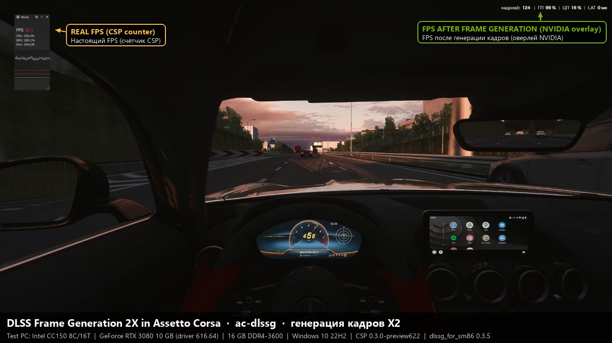
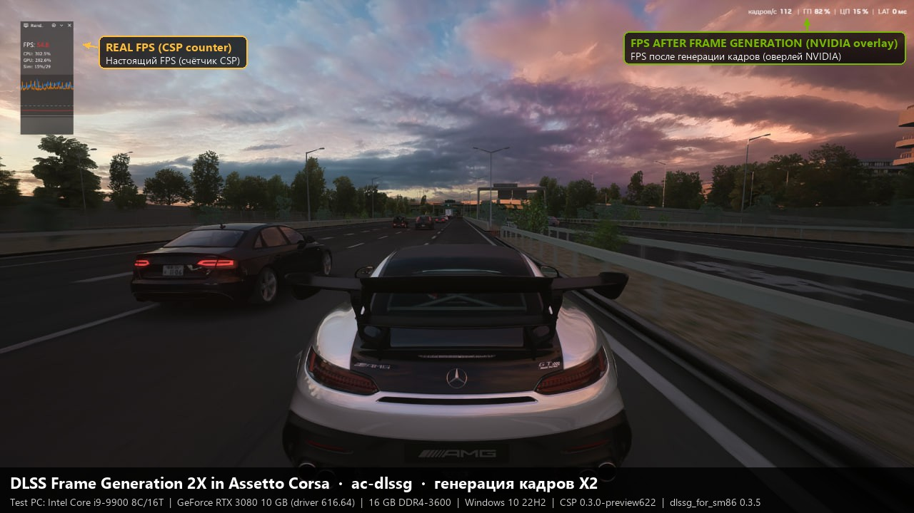
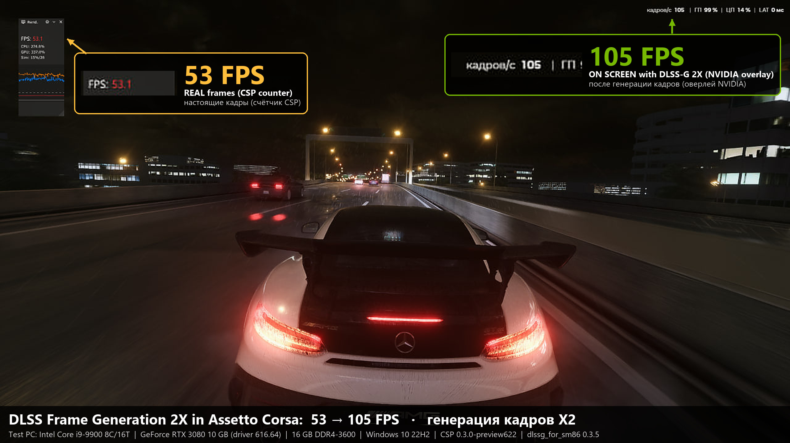
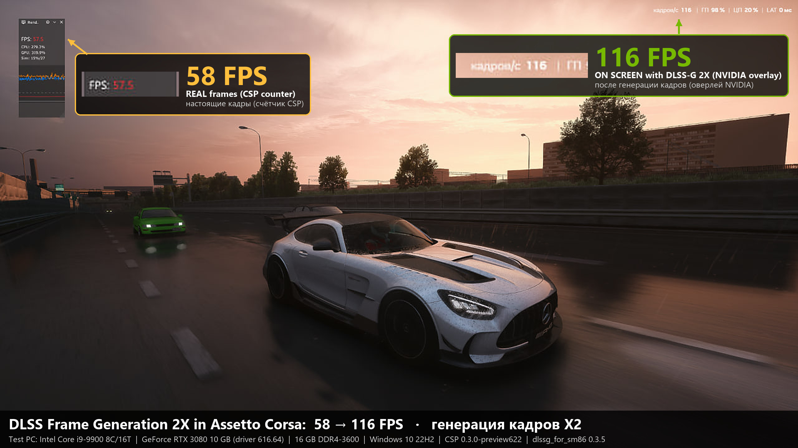
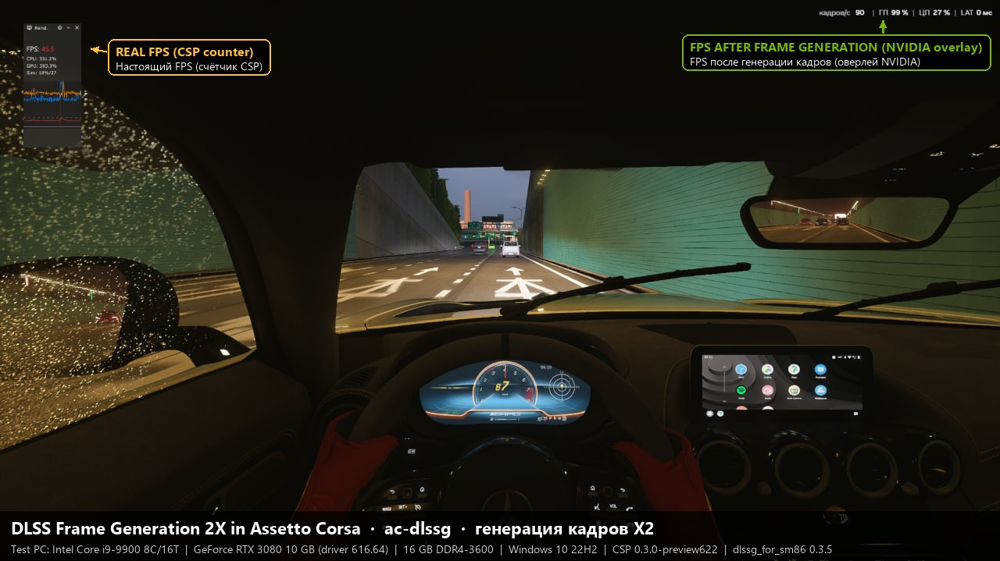
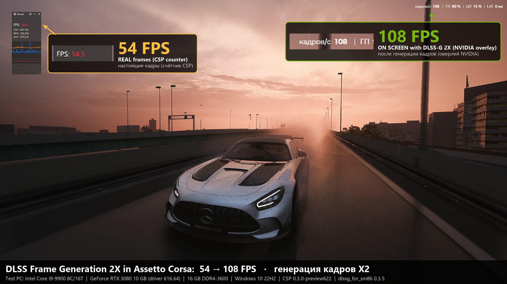
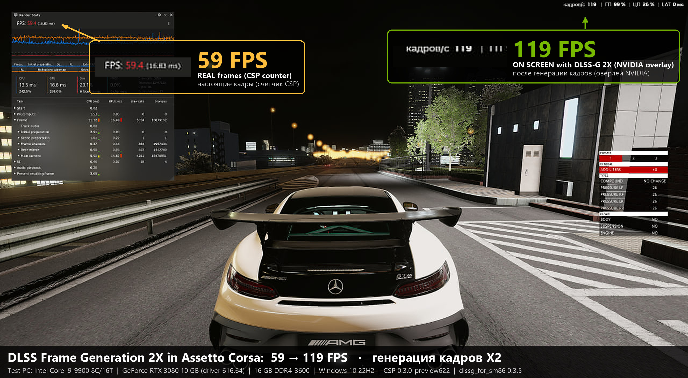

### DLSS-G 4X

The same PC with the window's **4X** button: about 40 real fps become about 160 on screen, with no ghosting and no stutter.

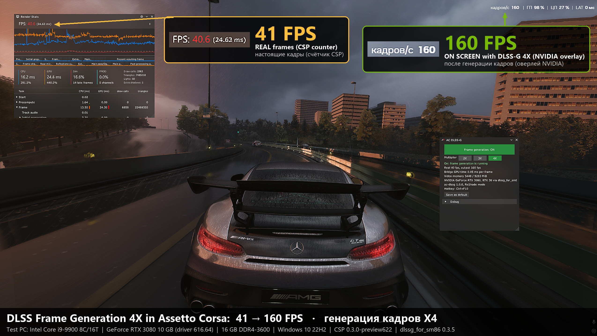
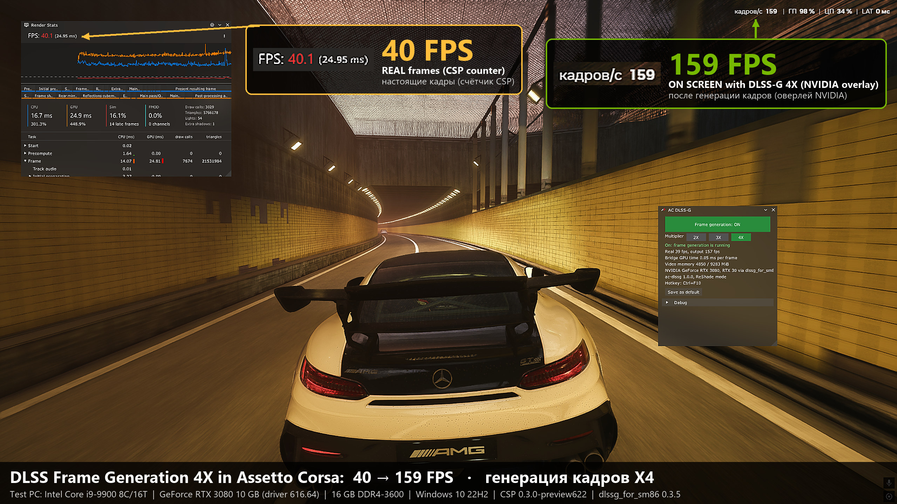
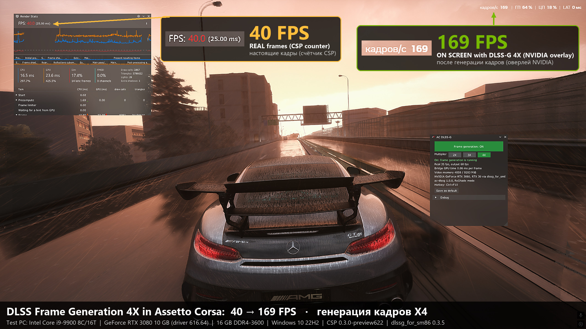
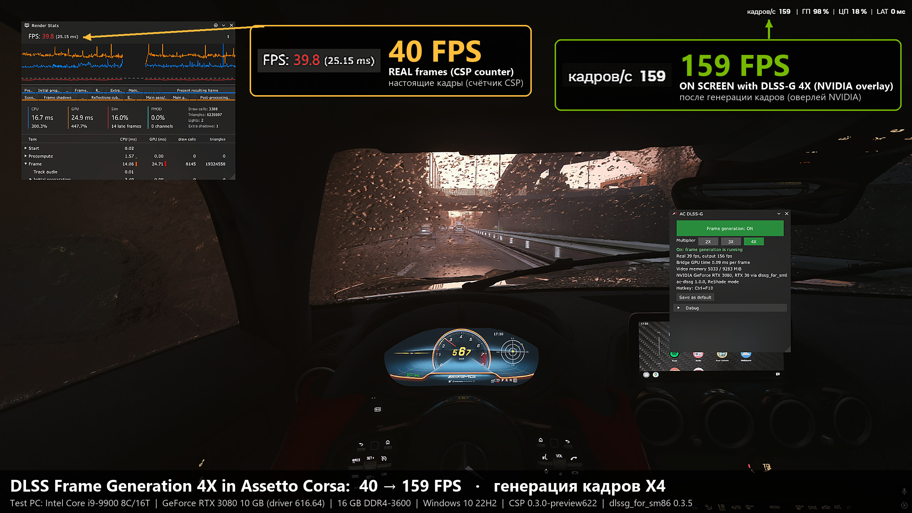

### Tested on a laptop

A friend's Acer Nitro 5 AN515-57: GeForce RTX 3050 Ti Laptop GPU (4 GB, driver 610.88), Core i5-11400H, 32 GB RAM, Windows 11 25H2, Optimus (the Intel iGPU drives the panel), no ReShade (standalone mode), CSP preview634. 31 real fps become 60 on screen.

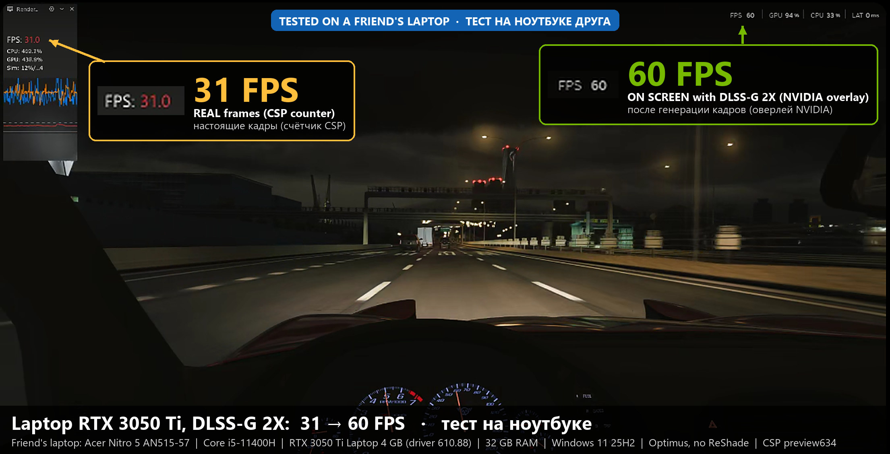
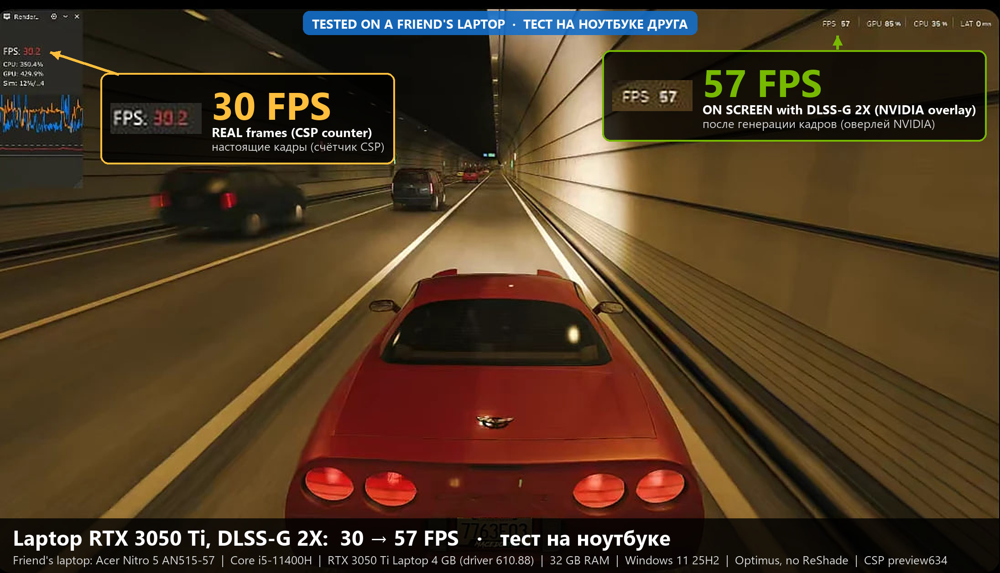

The same laptop at **4X**: 23 real fps become 89 on screen, and the 4 GB card had enough video memory for it.

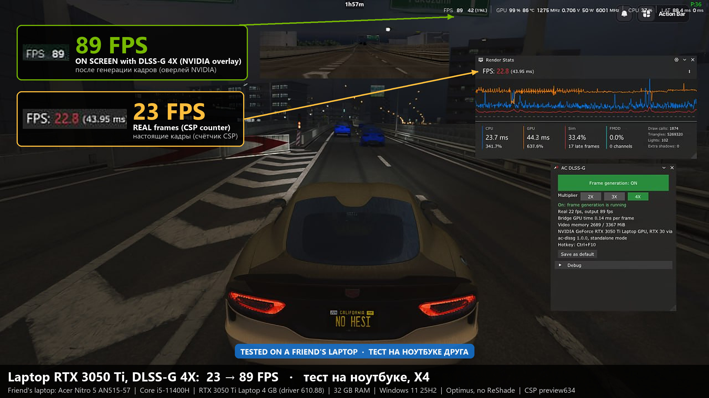

On a 4 GB card the video memory is tight. The bridge adapts to it by itself (`fg_vram_headroom_mib=auto`, see [Use](#use)): it keeps no extra memory free on such a card and turns frame generation on when it falls only a little short, and the window then says "video memory is tight". If the game stutters, lower CSP's texture or shadow quality.

## Requirements

- **Assetto Corsa** from Steam with a **Custom Shaders Patch preview build** (0.3.0-preview or newer). It was tested with preview622 and preview634. CSP preview builds are available from CSP's author on [Patreon](https://www.patreon.com/c/x4fab/home).
- **CSP's DLSS upscaling turned on**, in any quality mode including DLAA. Frame generation takes its depth and motion vectors from it. With DLAA, also turn off MSAA and FXAA in the game's video settings (Content Manager: Settings, Assetto Corsa, Video: MSAA Off, FXAA unticked, post-processing kept on), or moving things ghost.
- **An NVIDIA RTX GPU:**
  - RTX 40 and RTX 50 support DLSS-G themselves.
  - RTX 30, including laptop GPUs such as the RTX 3050 Ti, needs the third-party [dlssg_for_sm86](https://github.com/sdli1995/dlssg_for_sm86). You do not install it yourself: on an RTX 30 the installer downloads the pinned release 0.3.5 from the author's repository, checks its hashes and puts it next to `acs.exe`. See [RTX 30 and dlssg_for_sm86](#rtx-30-and-dlssg_for_sm86). It needs NVIDIA driver R580 or newer.
  - RTX 20 is not supported by this project.
- **Windows 10 version 2004 or newer, or Windows 11.** Hardware-accelerated GPU scheduling must be on: Settings > System > Display > Graphics > Change default graphics settings.
- **Laptops:** set `acs.exe` to "High performance" in the same Graphics settings, so the game runs on the NVIDIA GPU.
- **Internet on the first install.** The installer downloads NVIDIA Streamline 2.14.1 (about 276 MB) from NVIDIA's GitHub release and checks its hash and NVIDIA's signatures, and on an RTX 30 also dlssg_for_sm86 (about 30 MB). An update does not download them again while the installed copies are intact. This project never ships NVIDIA files or dlssg_for_sm86.
- **ReShade is optional.** With ReShade 6.8+ (add-on build) installed as `dxgi.dll`, the bridge loads through ReShade. Without it, the bridge itself is installed as `dxgi.dll`. The installer picks the mode.

## Install

1. Close Assetto Corsa and Content Manager's game session.
2. Download `ac-dlssg-<version>.zip` from [Releases](https://github.com/flopsy2iqq/ac-dlssg/releases) and extract it anywhere. The folder holds `install.bat` and the folders `docs`, `files`, `scripts` and `tools`.
3. Double-click `install.bat`. That is all: the installer asks nothing. It finds the game through Steam, downloads Streamline (and on an RTX 30 dlssg_for_sm86), prints where NVIDIA's license files are (installing means you accept them) and installs. If the game is under `C:\Program Files (x86)`, Windows asks for administrator rights; confirm, and the install goes on in a new window. At the end the window waits for Enter. Afterwards you can delete the unpacked folder and the zip: the uninstaller and the log collector are in the game folder, in `ac-dlssg`.
4. Before you start the game, turn on DLSS in CSP: in Content Manager, Settings, Custom Shaders Patch, ADJUSTMENTS (under Graphics), Upscaling: tick Active and set Method to NVIDIA DLSS (EXTRA FX must be active too). With DLAA (Quality: DLAA (100%)), also set MSAA to Off and untick FXAA in Settings, Assetto Corsa, Video, and keep post-processing on, or moving things ghost. Then start the game as usual.
5. Drive. Frame generation turns on by itself once CSP's DLSS runs; it stays off in the pause menu and the main menu.

**Upgrading:** run `install.bat` of the new package over the old install. It replaces the files of the old build, the uninstaller in `ac-dlssg` included, removes the ones the new build no longer ships, and switches between ReShade and standalone mode by itself when ReShade was installed or removed since. It stops only for files that are clearly not this project's, such as another mod's `dxgi.dll`. It does not download Streamline again when the installed files are intact (each matches its pinned SHA-256 and carries NVIDIA's signature; it then says "Streamline 2.14.1 is already installed and verified; not downloaded again"), and the same goes for dlssg_for_sm86 on an RTX 30.

**What changes in the game folder:** `dxgi.dll` (the bridge; with ReShade, `ac-dlssg.dll` and two lines in `ReShade.ini` instead), the folder `ac-dlssg` (Streamline in `sl`, `ac-dlssg.ini`, `logs`, the install record in `install`, and `uninstall.bat`, `collect-logs.bat` and the `scripts` they run), the CSP Lua app in `apps\lua\AcDlssg`, and on an RTX 30 `version.dll` and `dlssg_sm86.ini` next to `acs.exe` and the folder `dlssg_sm86` with dlssg_for_sm86's logs. `collect-logs.bat` writes its zips into `ac-dlssg`. Nothing else.

**Advanced:** `install.bat -NoSpoof` installs without dlssg_for_sm86; on an RTX 30 frame generation then does not run.

## Use

- **Ctrl+F10** switches frame generation on and off, for an A/B comparison of the same scene.
- The **AC DLSS-G** window (CSP's app bar, in both install modes) has the same switch, shows why frame generation is off, the real and output fps, the bridge's GPU time and video memory, and **Save as default** keeps the current switches in `ac-dlssg.ini`.
  - **2X / 3X / 4X** choose how many frames are shown per real frame; the change applies at once. 3X and 4X need a GPU and driver that allow them: RTX 50, or RTX 30 through dlssg_for_sm86 when NVIDIA's frame generation there reports multi frame support. A button above what the GPU allows is greyed out ("not supported by this GPU/driver"), and a note under the buttons says when a lower multiplier is used and why (the GPU's maximum, or not enough video memory for the higher one).
  - Under the video memory line, a note in orange says "video memory is tight ... frame generation on anyway" when the bridge turned frame generation on with little memory to spare. When it keeps frame generation off, the status line says "Off: not enough video memory ... lower CSP texture quality, shadows or the render resolution".
  - After **Save as default** the window says **Restart the game to apply**: the saved switches are the ones the game starts with next time (the current session already uses them).
- CSP's own FPS counter shows real frames. Use the NVIDIA overlay (Alt+R), RTSS or another external counter to see the frames on screen.
- Settings are in `<game>\ac-dlssg\ac-dlssg.ini`: `start_with_fg`, `hotkey`, `log_level`, `fg_multiplier` (2, 3 or 4; **Save as default** writes it too) and `fg_vram_headroom_mib`.
  - `fg_vram_headroom_mib=auto` (the default) is the video memory kept free on top of what frame generation needs, adapted to the GPU: none when the card's video memory budget is below 6 GB, 256 MiB above. With `auto`, frame generation also turns on when 2X falls short by at most 128 MiB (or a tenth of what it needs, if that is more), as long as at least half of what it needs is free. A number of MiB instead keeps exactly that much free and never turns frame generation on short. When that number is what keeps frame generation off and `auto` would let it run, the mod fixes it by itself: it switches to `auto` at once, saves `fg_vram_headroom_mib=auto` in `ac-dlssg.ini`, and the window says "Video memory setting fixed". No restart is needed.
  - Upgrading from an older build replaces an old default `fg_vram_headroom_mib=512` or `=0` (with the comment line the installer wrote above it) by `auto`; a value you set yourself stays.

## Uninstall

Open the game folder (in Steam: right-click Assetto Corsa, Manage, Browse local files), open `ac-dlssg` and double-click `uninstall.bat`. It restores every file the installer changed, and removes the bridge, the Streamline files, the Lua app and the dlssg_for_sm86 files the installer put there; a dlssg_for_sm86 you had before stays. After the Enter at its end it removes itself, `collect-logs.bat` and `scripts` too. Logs and settings stay in `<game>\ac-dlssg`; after the uninstall you can simply delete that folder. To remove them in the same run, start `uninstall.bat -RemoveData` there instead, which deletes all of `<game>\ac-dlssg` and also dlssg_for_sm86's logs and cache when the installer installed it. The package's `tools\uninstall.bat` does the same, if you still have the unpacked folder; version 1.0.0 has only that one.

## If something goes wrong

- **The game starts but the frame rate does not change.** Look at `<game>\ac-dlssg\logs\bridge.log`. The line `fg: DLSS-G on` means frame generation runs. A line `fg: frame without DLSS-G: <reason>`, or `DLSS-G is not supported on this adapter (...)`, says why it does not.
- **"Not enough video memory" in the window.** Frame generation needs the memory the window names. Lower CSP's texture quality, shadows or the render resolution; the bridge checks again every 60 frames and turns frame generation on when it fits.
- **"Bridge and window versions differ" in the window.** The bridge and the AC DLSS-G app come from different releases. Close the game and run `install.bat` of one release again.
- **The game crashes or does not start.** First double-click `<game>\ac-dlssg\collect-logs.bat` and keep the zip (see the next point), then run `<game>\ac-dlssg\uninstall.bat`; the game is then back to how it was. The zip stays in `<game>\ac-dlssg`.
- **Reporting a problem:** double-click `<game>\ac-dlssg\collect-logs.bat` after the game is closed. It only reads files and writes one zip into `<game>\ac-dlssg`; the window prints its full path. Attach that zip to a [GitHub issue](https://github.com/flopsy2iqq/ac-dlssg/issues).

## Known limitations

- 3X and 4X run only where the GPU and driver allow them (RTX 50, or RTX 30 through dlssg_for_sm86); elsewhere the bridge uses 2X and says so in the window.
- CSP app windows and on-screen UI can show small artifacts during fast motion. A HUD-less colour buffer is planned.
- The following are not supported: VR, triple screens, HDR output, MSAA, `EXCLUSIVE_FULLSCREEN=1`, and letterboxed output.
- Other CSP upscalers (FSR, XeSS) do not provide the inputs frame generation needs.

## RTX 30 and dlssg_for_sm86

NVIDIA locks DLSS Frame Generation to RTX 40 and newer. [dlssg_for_sm86](https://github.com/sdli1995/dlssg_for_sm86) by sdli1995, which includes Coldwood1026's RTX 20 work, lifts that lock on RTX 30. The author agreed to this project pointing to it.

- ac-dlssg does not contain or modify it. On an RTX 30 the installer downloads exactly `version.dll` and `dlssg_sm86.ini` of release 0.3.5 (commit `9621db5`) from the author's repository on your PC, checks their git hashes (and the SHA-256 of `version.dll`) before it installs anything, and prints this notice first. A `version.dll` that was in the game folder before the install is never replaced.
- That repository has no LICENSE file. Its README says the source is GPLv3, but no source is published.
- It embeds NVIDIA's `nvngx_dlssg.dll`, which is not relicensed.
- Using it on RTX 30 circumvents a technical limitation, which section 4.d of the NVIDIA RTX SDKs License forbids for that license's licensees.

Whether to use it is your decision: `install.bat -NoSpoof` installs without it, and `<game>\ac-dlssg\uninstall.bat` removes it again.

## How it works (short)

- `ac-dlssg.dll` (or `dxgi.dll` in standalone mode) exports the DXGI entry points and replaces CSP's DirectX 11 swap chain with a proxy.
- Every frame is copied through a shared texture to a DirectX 12 swap chain created through NVIDIA Streamline 2.14.1, with Reflex and PCL markers.
- CSP's DLSS evaluate call is hooked. Its depth and motion vectors are copied into shared textures and tagged for DLSS-G.
- The CSP Lua app `AcDlssg` writes the camera into shared memory. The bridge builds Streamline's camera constants from it.

The full design is in [docs/superpowers/specs](docs/superpowers/specs), and the milestone records are in [docs/superpowers/plans](docs/superpowers/plans).

## Building from source

Requirements: Visual Studio 2022 Build Tools (MSVC 14.44), Windows SDK 10.0.22621 and CMake.

```
powershell -NoProfile -ExecutionPolicy Bypass -File tools\fetch-deps.ps1
cmake -S . -B build -G "Visual Studio 17 2022" -A x64
cmake --build build --config Release
build\Release\acdb_tests.exe
powershell -NoProfile -ExecutionPolicy Bypass -File tools\make-test-package.ps1
```

`fetch-deps.ps1` stages the pinned Streamline SDK and NVAPI headers into `deps\`, which is git-ignored.

## Credits

- [dlssg_for_sm86](https://github.com/sdli1995/dlssg_for_sm86) by sdli1995, with Coldwood1026's work: DLSS-G on RTX 30. The installer downloads it from the author's repository on your PC.
- [NVIDIA Streamline](https://github.com/NVIDIA-RTX/Streamline): the SDK that delivers DLSS Frame Generation and Reflex. Its DLLs are downloaded from NVIDIA's release on your PC.
- [dlss5-bridge](https://github.com/NIGos/dlss5-bridge) (MIT): the approach for hooking CSP's DLSS call.
- [open-shaders](https://github.com/alandtse/open-shaders) and [Community Shaders](https://github.com/doodlum/skyrim-community-shaders): the DirectX 11 game plus DirectX 12 Streamline swap chain design.

## Verify a download

Every release zip is built by GitHub Actions from this repository, and the zip and `ac-dlssg.dll` carry build provenance attestations. The release notes list the SHA-256 of both. To check a downloaded file with the GitHub CLI:

```
gh attestation verify ac-dlssg-1.1.0.zip --repo flopsy2iqq/ac-dlssg
```

## Support

ac-dlssg is free, and every feature stays free. If you want to thank the author, you can [buy a coffee on Ko-fi](https://ko-fi.com/flopsy2iq). It is optional.

## License

GPL-3.0. See [LICENSE](LICENSE).
